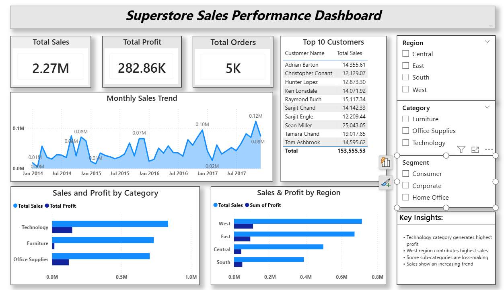

📊 Superstore Sales Analysis Dashboard

📌 Project Overview
This project analyzes retail sales data using SQL and Power BI to uncover business insights and trends.

🛠 Tools Used
MySQL (Data Cleaning & Analysis)
Power BI (Dashboard & Visualization)

📂 Dataset
Superstore dataset (Kaggle)

🔍 Key Analysis
1. Sales and profit analysis.
2. Category performance. 
3. Regional performance. 
4. Customer analysis. 
5. Monthly sales trends.

📈 Dashboard Features
1. KPI Cards (Sales, Profit, Orders)
2. Sales Trend Analysis
3. Category & Region Insights
4. Top Customers
5. Interactive Filters

💡 Key Insights
1. Technology category generates highest profit.
2. West region leads in sales.
3. Some sub-categories incur losses.
4. Sales show seasonal trends.

📷 Dashboard Preview

🚀 Conclusion
This project demonstrates end-to-end data analysis from data cleaning to visualization and business insights.
